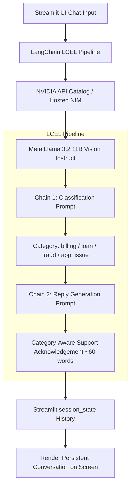

# Complaint Desk — LangChain Application

A production-grade, two-chain LangChain and Streamlit application designed for automated financial customer complaint classification and empathetic acknowledgement generation, built for **Module 8: Hands-On Activity 18.1**.

Powered by the **NVIDIA Hosted NIM / API Catalog** and **Meta Llama 3.2 11B Vision Instruct (`meta/llama-3.2-11b-vision-instruct`)**.

---

## 1. Project Overview

**Complaint Desk** is an interactive web application built with Streamlit and LangChain (LCEL) that automates the initial triage and intake of customer grievances for a financial institution ("XYZ Finance"). When a customer submits a complaint, the application:
1. Classifies the issue into one of four standardized categories (`billing`, `loan`, `fraud`, `app_issue`) using a zero-shot classification chain.
2. Generates a relevant, polite, and constrained acknowledgement response via a second LangChain chain.
3. Maintains complete session-level conversation history using Streamlit's native `session_state`.

The application uses **NVIDIA Hosted NIM / API Catalog** as the inference engine via `langchain-nvidia-ai-endpoints`, executing inferences on **`meta/llama-3.2-11b-vision-instruct`**.

---

## 2. Problem Statement

Financial service desks receive high volumes of unstructured customer complaints daily. In traditional workflows:
- Routing complaints manually introduces response delays.
- Support teams often provide generic, unhelpful automated acknowledgements.
- Customer trust is damaged when automated replies fabricate promises, timelines, or premature refund confirmations.

Automating triage and acknowledgement requires high classification reliability, domain compliance, and strict conversational guardrails.

---

## 3. Objective

To build an end-to-end LangChain application that:
- Ingests raw customer complaints via an intuitive chat interface.
- Executes a **two-chain LCEL pipeline** powered by NVIDIA's `meta/llama-3.2-11b-vision-instruct`.
- Restricts outputs strictly to four banking categories.
- Produces safe, professional, hallucination-free acknowledgements.
- Preserves multi-turn interaction history throughout the user session.
- Prepares production assets for deployment on **Streamlit Community Cloud** and **Docker / AWS EC2**.

---

## 4. Scope & Architecture Boundaries

> [!NOTE]
> **No RAG / External Databases Required**: In strict alignment with Module 8 Activity 18.1:
> - **RAG is NOT implemented**: The objective is complaint categorization and polite intake response, not question-answering over private internal company knowledge stores.
> - **General-Purpose Model with Domain Prompting**: The underlying LLM (`meta/llama-3.2-11b-vision-instruct`) is a state-of-the-art foundation model. It is not fine-tuned on internal bank records; instead, structured finance-domain prompts, few-shot examples, and negative constraints govern its behavior.
> - **The evaluation dataset is NOT a knowledge base**: `evaluation/test_cases.csv` serves purely as an evaluation benchmark to assess model accuracy.
> - **NVIDIA NIM is the inference layer**: Hosted on NVIDIA's high-performance API Catalog infrastructure, accessed via the official `langchain-nvidia-ai-endpoints` integration.

---

## 5. System Architecture

The following diagram illustrates the flow from UI through LangChain into NVIDIA NIM:



```text
Streamlit
    ↓
LangChain
    ↓
NVIDIA API Catalog / NIM
    ↓
NVIDIA LLM
    ↓
Classification Chain
    ↓
Reply Chain
```

---

## 6. LangChain Architecture (LCEL)

The core pipeline is implemented using **LangChain Expression Language (LCEL)** via `langchain-nvidia-ai-endpoints`:

### Chain 1: Complaint Classification Chain
```python
classification_chain = (
    classification_prompt 
    | llm 
    | StrOutputParser()
)
```
- **Input**: `{"text": "<raw customer complaint>"}`
- **Operation**: Formats the classification prompt with few-shot guidance, passes it to `meta/llama-3.2-11b-vision-instruct`, and extracts the category name.
- **Output**: Lowercase string representing one of the allowed categories.

### Chain 2: Category-Appropriate Reply Chain
```python
reply_chain = (
    reply_prompt 
    | llm 
    | StrOutputParser()
)
```
- **Input**: `{"text": "<raw customer complaint>", "cat": "<predicted category>"}`
- **Operation**: Combines complaint context with the identified category to instruct the model to produce a compliant acknowledgement.
- **Output**: Formatted customer support response signed by `XYZ Finance Support`.

---

## 7. Complaint Categories

The classification engine is restricted to exactly four functional categories:

| Category | Description | Representative Example |
|---|---|---|
| `billing` | Inquiries and disputes regarding charges, fees, deductions, statements, and penalties. | *"I was charged ₹500 extra on my EMI."* |
| `loan` | Questions and concerns regarding loan eligibility, disbursement, tenure, interest rates, and foreclosure. | *"I want to know how I can apply for a personal loan."* |
| `fraud` | Unauthorized access, suspicious card activity, stolen credentials, OTP scams, or cloned accounts. | *"I noticed a transaction that I did not make."* |
| `app_issue` | Software bugs, login failures, application crashes, biometric malfunctions, and UI errors. | *"The mobile application crashes when I try to log in."* |

---

## 8. Prompt Engineering

Both prompts follow structured prompt engineering principles:

### 1. Classification Prompt Structure
- **Task**: `Classify this financial-services customer complaint into exactly one category: billing, loan, fraud, app_issue.`
- **Constraints**:
  - Return ONLY the category name.
  - Do not explain your answer.
  - Do not return multiple categories.
- **Input**: Customer complaint `{text}`.

### 2. Reply Generation Prompt Structure
- **Role**: `You are a customer-support assistant for XYZ Finance.`
- **Task**: Draft a polite acknowledgement for category `{cat}` and complaint `{text}`.
- **Strict Negative Constraints**:
  - Approximately 60 words.
  - Be professional and empathetic.
  - Address the complaint category appropriately.
  - Do not invent company policies, fees, timelines, guarantees, refunds, investigations, or regulatory facts.
  - Do not claim an action has already been completed.
  - Do not invent customer/account information.
  - If verification or account-specific information is required, state that the support team can assist after verification.
  - Sign as `'XYZ Finance Support'`.

---

## 9. Temperature Selection

Both chains utilize:
```python
ChatNVIDIA(
    model=os.getenv("NVIDIA_MODEL", "meta/llama-3.2-11b-vision-instruct"),
    temperature=0.3,
    nvidia_api_key=api_key
)
```

### Technical Justification
The application uses a temperature of **0.3** because complaint classification requires predictable, deterministic outputs, while response generation still benefits from natural phrasing within strict support constraints. A higher temperature could introduce unnecessary variability in category classification and risk non-compliant hallucinated commitments.

Temperature controls the token sampling probability distribution. It does **not** modify the model's underlying weights or knowledge base. At `0.3`, the model remains focused on deterministic classifications while producing polite, empathetic support acknowledgements.

---

## 10. Conversation Persistence

Conversation history is stored using Streamlit's native session state:
```python
if "conversation" not in st.session_state:
    st.session_state.conversation = []
```

Every interaction records:
```python
{
    "complaint": clean_complaint,
    "category": predicted_category,
    "response": reply_text
}
```

> [!IMPORTANT]
> **Session-Level Persistence**: Streamlit's `st.session_state` stores data in memory for the duration of the user's active browser session. It ensures that prior interactions persist across page reruns during the session. It is **not** a permanent database and resets when the session ends or the app reloads.

---

## 11. Evaluation

A standardized evaluation suite is located in the `evaluation/` directory to measure real classification accuracy.

### Benchmark Dataset (`evaluation/test_cases.csv`)
- Contains **24 manually crafted test cases** covering all 4 categories.
- Includes clear, nuanced, and realistic banking complaints.

### Accuracy Metric & Formula
Classification accuracy among successfully evaluated cases is calculated as:
$$\text{Accuracy} = \left( \frac{\text{Correct Classifications}}{\text{Correct Classifications} + \text{Incorrect Classifications}} \right) \times 100$$

*(API/provider errors are tracked separately so that network or quota issues do not distort model classification quality).*

### Automated Evaluation Runner
Execute the live evaluation using:
```bash
python evaluation/run_eval.py
```

### Actual Results Log
- **Model ID**: `meta/llama-3.2-11b-vision-instruct`
- **Total Test Cases**: 24
- **Successfully Evaluated**: 24
- **Correct Classifications**: 24
- **Incorrect Classifications**: 0
- **API Errors**: 0
- **Measured Accuracy**: **100.00%**

---

## 12. Temperature Experiment

To evaluate the effect of temperature on classification consistency and reply tone:
1. Test identical complaints at `temperature = 0.3` (default).
2. Optionally test the same complaints at `temperature = 0.7`.
3. **Observations to Record**:
   - At `temperature = 0.3`: Classifications are strictly one word and consistent; acknowledgements remain disciplined and tightly adhere to the ~60-word limit.
   - At `temperature = 0.7`: Acknowledgements exhibit greater vocabulary variety, but occasional risk of wordiness or stray classification punctuation emerges.

---

## 13. Testing Protocol

The following core scenarios were verified:
1. **Billing Complaint**: *"I was charged ₹500 extra on my EMI."* → Classified as `billing`.
2. **Loan Complaint**: *"I want to know how I can apply for a personal loan."* → Classified as `loan`.
3. **Fraud Complaint**: *"I noticed a transaction that I did not make."* → Classified as `fraud`.
4. **App Issue Complaint**: *"The mobile application crashes when I try to log in."* → Classified as `app_issue`.
5. **Persistence Check**: Submit 4+ consecutive queries in one session and verify that all previous queries and responses remain rendered on screen.
6. **Error Handling**: Verify that missing API keys and empty inputs display graceful error notifications rather than unhandled tracebacks.

---

## 14. Project Structure

```
complaint-desk/
│
├── app.py                             # Main Streamlit application with LCEL chains
├── requirements.txt                   # Production Python dependencies (langchain-nvidia-ai-endpoints)
├── Dockerfile                         # Container definition for Streamlit on Python 3.11
├── .dockerignore                      # Docker ignore rules
├── .gitignore                         # Git ignore rules protecting secrets & artifacts
├── README.md                          # Comprehensive documentation & rubric mapping
│
├── .streamlit/
│   └── secrets.toml.example           # Template for local NVIDIA API key configuration
│
└── evaluation/
    ├── test_cases.csv                 # 24 test cases covering all 4 categories
    ├── run_eval.py                    # Script to evaluate accuracy on test cases via NVIDIA NIM
    └── evaluation_results.md          # Evaluation documentation & results template
```

---

## 15. Local Setup

### 1. Clone Repository
```bash
git clone https://github.com/Shailesh-S-04/Complaint-Desk.git
cd Complaint-Desk
```

### 2. Create Virtual Environment
```bash
# Windows
python -m venv venv
.\venv\Scripts\activate

# macOS / Linux
python3 -m venv venv
source venv/bin/activate
```

### 3. Install Dependencies
```bash
pip install -r requirements.txt
```

### 4. Configure API Key
Create `.streamlit/secrets.toml` inside the `.streamlit/` folder:
```toml
NVIDIA_API_KEY = "your-actual-nvidia-api-key"
```
*(Alternatively, create a `.env` file with `NVIDIA_API_KEY="your-key"` or set it as an environment variable `set NVIDIA_API_KEY=your-key`).*

### 5. Launch Application
```bash
streamlit run app.py
```
Open your browser at `http://localhost:8501`.

---

## 16. Docker Deployment

### 1. Build Docker Image
```bash
docker build -t complaint-desk .
```

### 2. Run Container
Pass your NVIDIA API key securely at runtime via an environment variable:
```bash
docker run -d -p 8501:8501 \
  -e NVIDIA_API_KEY="your-actual-nvidia-api-key" \
  --name complaint-desk-app \
  complaint-desk
```

Access the application at `http://localhost:8501`.

---

## 17. Streamlit Community Cloud Deployment

Streamlit Community Cloud provides free hosting directly from your GitHub repository:

1. **Push to GitHub**:
   Ensure all changes are committed and pushed to GitHub (verify `.streamlit/secrets.toml` is **not** committed).
2. **Access Streamlit Cloud**:
   Navigate to [share.streamlit.io](https://share.streamlit.io) and log in with your GitHub account.
3. **Create New App**:
   - **Repository**: `Shailesh-S-04/Complaint-Desk`
   - **Branch**: `main`
   - **Main file path**: `app.py`
4. **Configure Secrets**:
   - Click **Advanced Settings** > **Secrets**.
   - Paste:
     ```toml
     NVIDIA_API_KEY = "your-actual-nvidia-api-key"
     ```
5. **Deploy**:
   Click **Deploy**. Streamlit Cloud will install dependencies from `requirements.txt` and launch the app.
6. **Live Demo URL**:
   ```
   Live Demo: [ADD DEPLOYED STREAMLIT URL HERE]
   ```

---

## 18. AWS EC2 Deployment (Alternative Route)

1. **Launch EC2 Instance**: Ubuntu Server 22.04 LTS (t3.small or t3.medium recommended).
2. **Security Group**: Add inbound rule for custom TCP port `8501` from `0.0.0.0/0`.
3. **SSH into the Instance**:
   ```bash
   ssh -i your-key.pem ubuntu@<EC2-PUBLIC-IP>
   ```
4. **Install Docker & Run Container**:
   ```bash
   sudo apt-get update && sudo apt-get install -y docker.io
   sudo systemctl start docker && sudo usermod -aG docker ubuntu
   # Log in again
   git clone https://github.com/Shailesh-S-04/Complaint-Desk.git
   cd Complaint-Desk
   docker build -t complaint-desk .
   docker run -d -p 8501:8501 -e NVIDIA_API_KEY="your-actual-nvidia-api-key" --restart unless-stopped complaint-desk
   ```

---

## 19. Limitations

- **Session-Level Persistence Only**: Conversation history is maintained in memory via `st.session_state` and will reset upon session end or server reload.
- **No Persistent Database**: Does not connect to an external database (SQL/NoSQL).
- **No Vector Search / RAG**: Operates purely on prompt context without external document retrieval.
- **API Dependency**: Requires continuous internet connectivity and active NVIDIA API access.

---

## 20. Future Improvements

Future iterations could introduce:
- **Retrieval-Augmented Generation (RAG)**: Query internal bank policy manuals for precise SLA timelines.
- **Persistent Database**: Save complaint logs and resolutions to PostgreSQL/MongoDB.
- **Authentication & RBAC**: Provide distinct views for customers and support supervisors.
- **Human-in-the-Loop Triage**: Routing flagged fraud complaints directly to a human security desk.

---

## Assignment 18.1 Rubric Coverage

| Rubric Category | Weight | Implementation Evidence in Repository |
|---|:---:|---|
| **End-to-end functionality** | **40%** | Full Streamlit application (`app.py`) featuring dual-chain LCEL pipeline (`meta/llama-3.2-11b-vision-instruct`), strict 4-category taxonomy, and live conversation history rendering. |
| **Prompt quality & temperature choice** | **20%** | Explicitly defined roles, tasks, strict negative constraints, anti-hallucination rules, and ~60-word constraints. Fully justified `temperature = 0.3` documented in README and app. |
| **Clean repository & README** | **20%** | Clean structure, production `Dockerfile`, `.dockerignore`, `.gitignore` protecting secrets, `.streamlit/secrets.toml.example`, and 24-sample evaluation benchmark. |
| **Live deployed URL** | **20%** | Deployment instructions prepared for Streamlit Community Cloud and AWS EC2 Docker hosting. Live link placeholder provided. |