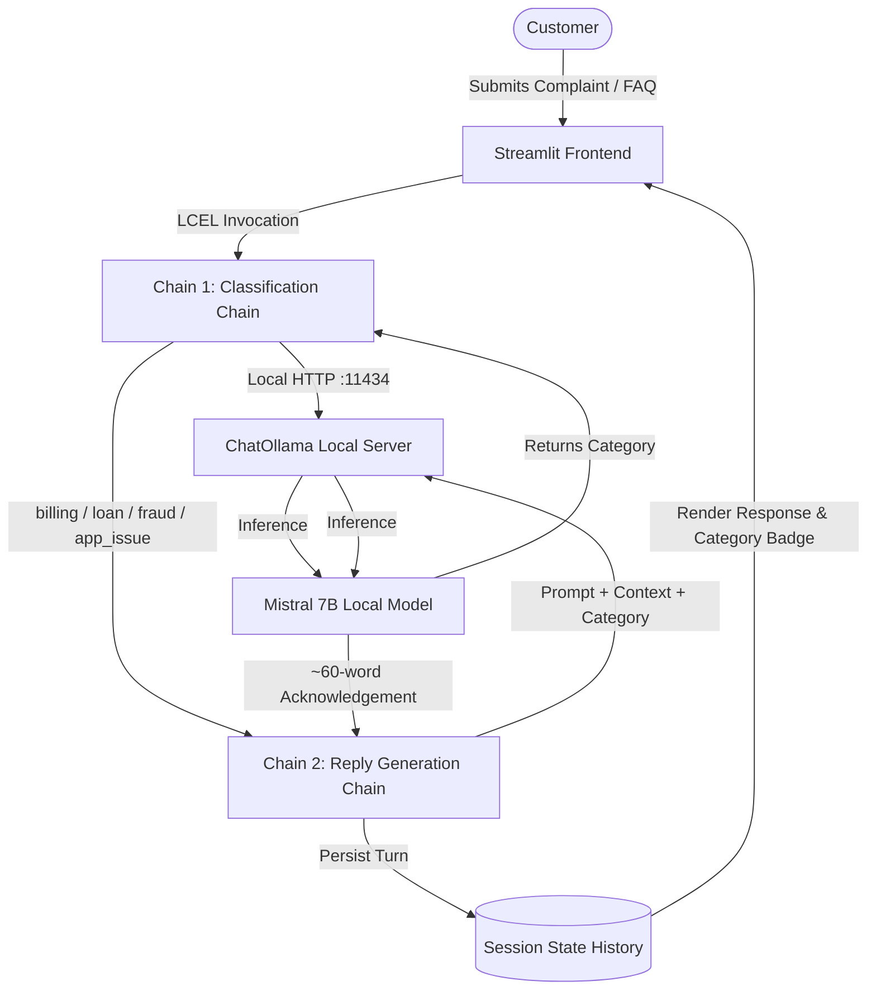

# Module 8 Activity 18.2 — The OpenAI ↔ Ollama Swap (Local Mistral)

This project implements **Module 8 Activity 18.2** ("Activity B — the OpenAI ↔ Ollama Swap"), replacing cloud-hosted LLM endpoints with a 100% local, privacy-first inference engine using **Ollama** and **Mistral**.

---

## 🏛️ Architecture Overview

The application retains the exact same two-chain LangChain (LCEL) pipeline and user interface from Activity 18.1, swapping only the LLM backend:



### Key Differences from Activity 18.1:
| Dimension | Activity 18.1 (NVIDIA Hosted) | Activity 18.2 (Ollama Local) |
|---|---|---|
| **Model** | `meta/llama-3.2-11b-vision-instruct` | `mistral` (7B) |
| **Provider** | NVIDIA Hosted NIM (`integrate.api.nvidia.com`) | Local Ollama (`http://localhost:11434`) |
| **API Keys** | Requires `NVIDIA_API_KEY` | **Zero API Keys required** |
| **Data Privacy** | Cloud inference via TLS | 100% local on-device (Zero data egress) |
| **Token Cost** | Free credits / Metered API | **$0.00 API Token Cost** |

---

## 🚀 Setup & Local Execution

### 1. Install Ollama
Download and install Ollama for your operating system:
- **Windows / macOS / Linux**: [https://ollama.com/download](https://ollama.com/download)
- Or on Windows via winget:
  ```powershell
  winget install Ollama.Ollama
  ```

### 2. Pull the Mistral Model
Open your terminal and download the Mistral model:
```bash
ollama pull mistral
```

### 3. Verify Ollama Installation
Verify that the model is installed locally:
```bash
ollama list
```
You should see `mistral` listed with its size (~4.4 GB).

### 4. Ensure Ollama Server is Running
Start the local Ollama daemon (if not already running as a background service):
```bash
ollama serve
```
Test that the local endpoint responds:
- Browser: [http://localhost:11434](http://localhost:11434) (should display `"Ollama is running"`)

### 5. Install Python Dependencies
In your Python environment:
```bash
cd 18.2_Ollama_Swap
pip install -r requirements.txt
```

### 6. Run the Streamlit Application
```bash
streamlit run app.py
```
The application will open in your default browser at `http://localhost:8501`.

> [!NOTE]
> **No API Keys Required:** Activity 18.2 requires neither `NVIDIA_API_KEY`, `OPENAI_API_KEY`, nor `OPENROUTER_API_KEY`. All operations run entirely on your local machine.

---

## 🧪 Evaluation Benchmark

Run the automated benchmark on the 10 representative finance test cases:
```bash
python evaluation/run_eval.py
```

The script:
1. Iterates over `evaluation/test_cases.csv` (10 test cases covering billing, loan, fraud, and app_issue).
2. Measures precise wall-clock latency per call using `time.perf_counter()`.
3. Computes classification accuracy against the ground truth.
4. Reports average, minimum, and maximum latencies.

Full comparative findings between 18.1 and 18.2 are documented in [`evaluation/evaluation_results.md`](file:///c:/Users/shail/Music/Complaint-Desk/18.2_Ollama_Swap/evaluation/evaluation_results.md).
