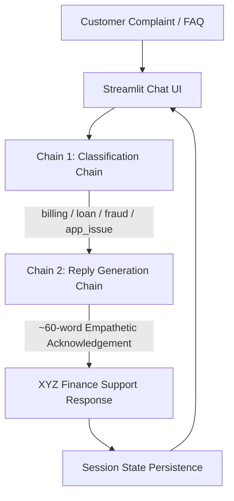

# Module 8 — Complaint Desk Generative AI Project

**Academic Course Module 8: GenAI Application Engineering**  
Hands-On Activities 18.1 and 18.2: Complaint Desk LangChain Applications (Hosted NIM vs Local Ollama Swap).

---

## 📂 Repository Organization

This repository contains two parallel implementations of the **Complaint Desk** application, designed to evaluate and compare cloud-hosted vs. on-device Generative AI architectures:

```text
Complaint-Desk/
├── 18.1_Complaint_Desk/           # Activity 18.1 — Cloud-Hosted LLM
│   ├── app.py                     # Streamlit app using ChatNVIDIA (meta/llama-3.2-11b-vision-instruct)
│   ├── requirements.txt           # Minimal dependencies for hosted NIM
│   ├── Dockerfile                 # Containerized deployment spec
│   ├── .dockerignore
│   ├── .gitignore
│   ├── README.md                  # Comprehensive documentation for 18.1
│   ├── .streamlit/
│   │   └── secrets.toml.example   # NVIDIA API key template
│   └── evaluation/
│       ├── test_cases.csv         # 24-case benchmark dataset
│       ├── run_eval.py            # Automated evaluation runner for 18.1
│       └── evaluation_results.md  # Detailed benchmark report (100% accuracy)
│
├── 18.2_Ollama_Swap/              # Activity 18.2 — Local On-Device LLM
│   ├── app.py                     # Streamlit app using ChatOllama (mistral)
│   ├── requirements.txt           # Minimal dependencies for local Ollama
│   ├── README.md                  # Setup & execution guide for local Ollama
│   ├── .gitignore
│   └── evaluation/
│       ├── test_cases.csv         # 10 shared test complaints
│       ├── run_eval.py            # Latency and accuracy evaluation runner
│       └── evaluation_results.md  # One-page empirical comparison report
│
└── README.md                      # This root documentation file
```

---

## 🏛️ Application Architecture & Two-Chain Workflow

Both implementations share the exact same user experience, Streamlit chat interface, and strict **two-chain LangChain (LCEL)** workflow:



### Strict Architectural Scope (No Extra Frameworks):
- **Zero RAG**: No vector databases (ChromaDB, FAISS).
- **No Embeddings**: Pure prompt engineering with domain few-shot exemplars.
- **No Agents or LangGraph**: Pure deterministic two-chain LCEL pipeline.
- **In-Memory State**: Session persistence managed via `st.session_state`.

---

## ⚖️ Executive Comparison: Activity 18.1 vs Activity 18.2

| Evaluation Criterion | Activity 18.1 (Cloud Hosted) | Activity 18.2 (Local Ollama Swap) |
|---|---|---|
| **Module Activity** | Module 8, Activity 18.1 | Module 8, Activity 18.2 |
| **Model** | `meta/llama-3.2-11b-vision-instruct` (11B parameters) | `mistral` (7B parameters) |
| **LLM Provider** | NVIDIA Hosted NIM (`integrate.api.nvidia.com`) | Ollama Local (`http://localhost:11434`) |
| **LangChain Class** | `ChatNVIDIA` | `ChatOllama` |
| **Authentication** | `NVIDIA_API_KEY` (Required) | **None** (100% local, no key needed) |
| **Data Privacy** | Payloads sent over TLS to cloud infrastructure | **Zero data egress** (Processed entirely on-device) |
| **API Token Cost** | Pay-per-token / developer credits | **$0.00** API token charges |
| **Infrastructure Cost** | None for local client (serverless model) | Client GPU/CPU, RAM (~4.5GB), and electricity |
| **Target Deployment** | Streamlit Cloud, AWS EC2, Enterprise SaaS | Air-gapped on-premise, secure bank branches |

---

## 🚀 Quick Start Guide

### Running Activity 18.1 (NVIDIA Hosted NIM)
```bash
cd 18.1_Complaint_Desk
pip install -r requirements.txt
# Set NVIDIA_API_KEY in .env or .streamlit/secrets.toml
streamlit run app.py
```

### Running Activity 18.2 (Local Ollama Mistral)
```bash
# 1. Install Ollama and pull Mistral
ollama pull mistral

# 2. Run the application
cd 18.2_Ollama_Swap
pip install -r requirements.txt
streamlit run app.py
```

---

## 📊 Evaluation & Empirical Comparison

Both versions were evaluated against identical benchmark financial complaints covering all four taxonomy categories (`billing`, `loan`, `fraud`, `app_issue`).

For the comprehensive, data-backed comparison report and the final banking deployment analysis (*"Which Would I Ship for a Bank, and Why?"*), please refer to:
- [`18.2_Ollama_Swap/evaluation/evaluation_results.md`](file:///c:/Users/shail/Music/Complaint-Desk/18.2_Ollama_Swap/evaluation/evaluation_results.md)